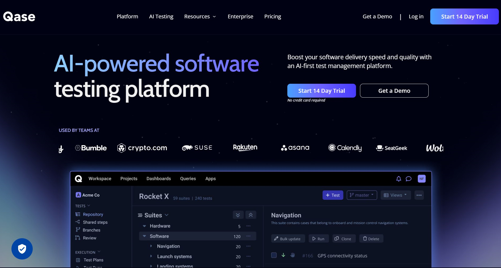

# Проект автоматизации тестирования сервиса [QASE](https://app.qase.io/)

> Qase — это современная платформа управления тестированием для ручного и автоматизированного тестирования качества,\
> отслеживания и составления отчетов, которая помогает быстрее создавать программное обеспечение более высокого качества.

 # <a name="Описание">Описание</a>
 Проект тестирования включает в себя тесты пользовательского интерфейса и API. \
 Краткий список интересных фактов о проекте:
