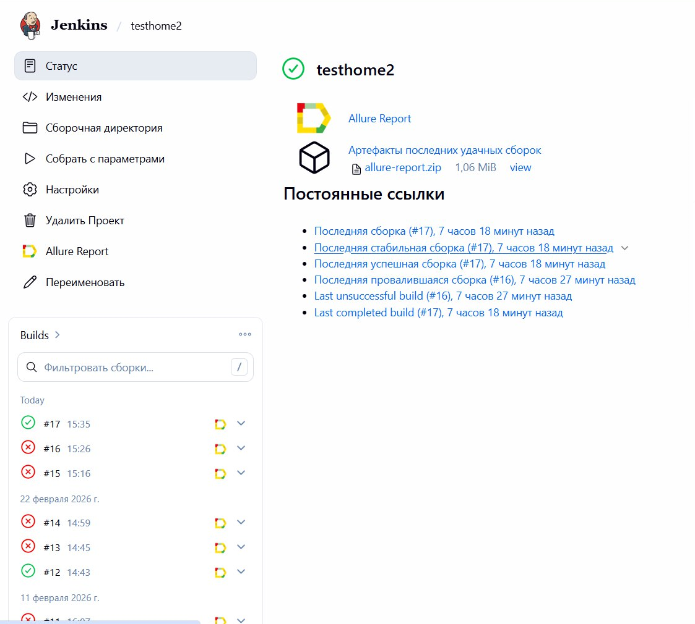
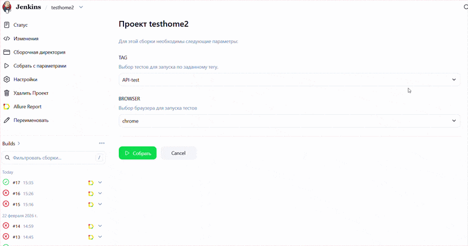

# Проект автоматизации тестирования сервиса [QASE](https://app.qase.io/)

> Qase — это современная платформа управления тестированием для ручного и автоматизированного тестирования качества,\
> отслеживания и составления отчетов, которая помогает быстрее создавать программное обеспечение более высокого качества.

 # <a name="Описание">Описание</a>
 Проект тестирования включает в себя тесты пользовательского интерфейса и API. \
 Краткий список интересных фактов о проекте:
- [x] Архитектура автотестов базируется на паттерне Fluent Page Object, обеспечивающем последовательное выполнение шагов через цепочку вызовов (method chaining)
- [x] Генерация фиктивных данных с помощью библиотеки `Faker`
- [x] Конфигурация с использованием библиотеки `Owner`
- [x] Использование `Lombok` для моделей в тестах API   
- [x] Параметризованные тесты
- [x] Параметризованная сборка
- [x] Для запуска тестов используются разные конфигурационные файлы в зависимости от параметров сборки
- [x] Сериализация/десериализация объектов для запросов/ответов API с использованием `Jackson`
- [x] Использование спецификаций запроса/ответа для тестирования API
- [x] Пользовательский Allure listener для красивого логирования запросов/ответов API
- [x] Автоматические тесты как тестовая документация

# <a name="Технология">Инструменты и технологии</a>
<p  align="center">
  <code></code>
   <code></code>
  <code></code>
  <code></code>
  <code></code>
  <code></code>
  <code></code>
  <code></code>
  <code></code>
  <code></code>
</p>

 Автотесты в этом проекте написаны на Java с использованием фреймворка Selenide.\
`Gradle` - инструмент для сборки и автоматизации проекта.\
`JUnit5` - фреймворк для написания и запуска автоматических тестов.\
`REST Assured` - Java-библиотека, созданная специально для тестирования REST API.\
`Jenkins` - CI/CD сервер, который объединяет все инструменты в единый автоматический процесс.\
`Selenoid` - инструмент, который берет на себя всю работу с браузерами, запуская каждый из них в отдельном Docker-контейнере.\
`Allure Report` - визуализация результатов тестирования.\
`Telegram Bot` - уведомления о результатах тестирования.\

# <a name="Запуск">Запуск</a>

## <a name="Команды Gradle">Команды Gradle</a>
Для запуска локально и в Jenkins используется следующая команда:
```bash
clean -Dtag=${TAG} -Dbrowser=${BROWSER} test
```


`tag` - тесты с этим тегом будут выполнены:
>- *API-test*
>- *UI-test*

## <a name="Запуск в Jenkins">Запуск в [Jenkins](http://localhost:8080/job/testhome2/)</a>
Главная страница сборки:
<p  align="center">

</p>

Параметризованное задание Jenkins можно запустить с необходимыми параметрами ***tag***:
<p  align="center">

</p>

Конфиденциальная информация (имена пользователей и пароли) хранится в зашифрованном виде в хранилище учетных данных Jenkins.
И относительно безопасно передается в сборку через аргументы Gradle.

After the build is done the test results are available in:
>- <code><strong>*Allure Report*</strong></code>

<p  align="center">

</p>
